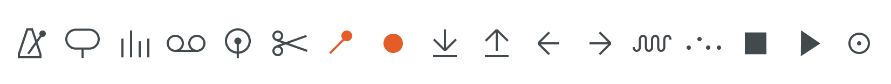

A replica of [Teenage Engineering's OP-1 Field](https://teenage.engineering/store/op-1-field/), crafted in Figma. The OP-1 has become a source of inspiration for designers and musicians alike, due to its aesthetic appeal, innovative design and remarkable functionality.

The replication involved the creation of modular components to construct the various keys and the icons displayed on each key.

See the full specs [here](https://www.figma.com/community/file/1305106975990547623/op-1-field).
